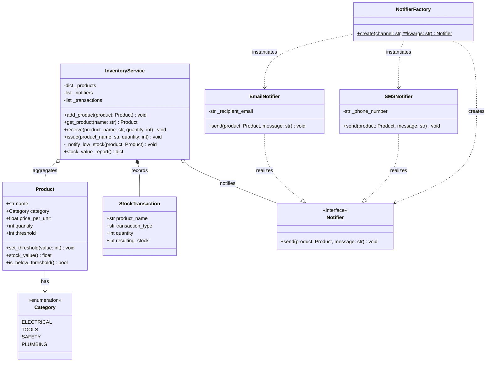

# Class Diagram

แผนภาพ Class Diagram ของระบบจัดการสต็อกสินค้า (Inventory System)

```mermaid
classDiagram
    direction TB

    class Category {
        <<enumeration>>
        ELECTRICAL
        TOOLS
        SAFETY
        PLUMBING
    }

    class Product {
        +str name
        +Category category
        +float price_per_unit
        +int quantity
        +int threshold
        +set_threshold(value: int) void
        +stock_value() float
        +is_below_threshold() bool
    }

    class StockTransaction {
        +str product_name
        +str transaction_type
        +int quantity
        +int resulting_stock
    }

    class Notifier {
        <<interface>>
        +send(product: Product, message: str) void
    }

    class EmailNotifier {
        -str _recipient_email
        +send(product: Product, message: str) void
    }

    class SMSNotifier {
        -str _phone_number
        +send(product: Product, message: str) void
    }

    class NotifierFactory {
        +create(channel: str, **kwargs: str)$ Notifier
    }

    class InventoryService {
        -dict _products
        -list _notifiers
        -list _transactions
        +add_product(product: Product) void
        +get_product(name: str) Product
        +receive(product_name: str, quantity: int) void
        +issue(product_name: str, quantity: int) void
        -_notify_low_stock(product: Product) void
        +stock_value_report() dict
    }

    Product --> Category : has
    InventoryService o-- Product : aggregates
    InventoryService *-- StockTransaction : records
    InventoryService o-- Notifier : notifies
    EmailNotifier ..|> Notifier : realizes
    SMSNotifier ..|> Notifier : realizes
    NotifierFactory ..> Notifier : creates
    NotifierFactory ..> EmailNotifier : instantiates
    NotifierFactory ..> SMSNotifier : instantiates
```
