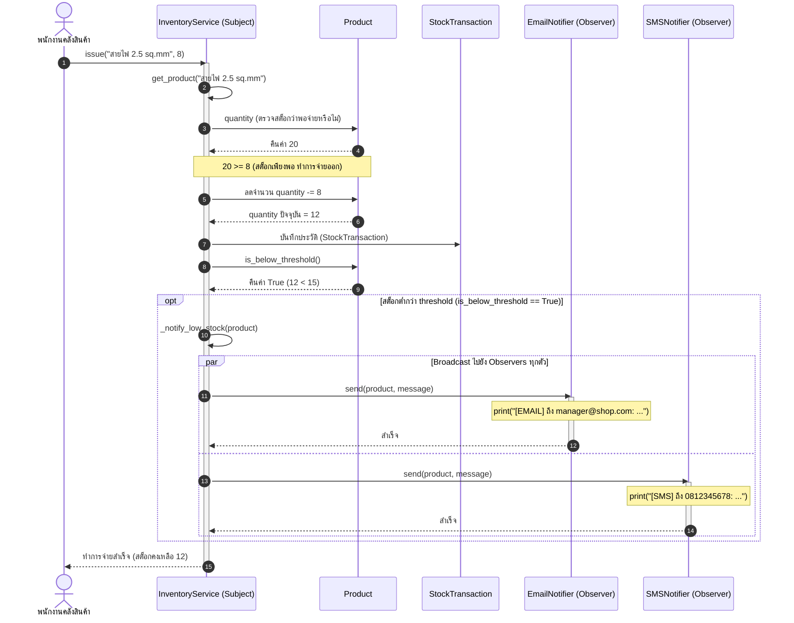

# Sequence Diagram

แผนภาพ Sequence Diagram แสดงลำดับการทำงานเมื่อพนักงานบันทึกจ่ายสินค้าจนสต็อกต่ำกว่า threshold พร้อมการกระจายแจ้งเตือนไปยัง Observers

```mermaid
sequenceDiagram
    autonumber
    actor Staff as พนักงานคลังสินค้า
    participant Service as InventoryService (Subject)
    participant Product as Product
    participant Trans as StockTransaction
    participant Email as EmailNotifier (Observer)
    participant SMS as SMSNotifier (Observer)

    Staff->>Service: issue("สายไฟ 2.5 sq.mm", 8)
    activate Service

    Service->>Service: get_product("สายไฟ 2.5 sq.mm")
    Service->>Product: quantity (ตรวจสต็อกว่าพอจ่ายหรือไม่)
    Product-->>Service: คืนค่า 20

    Note over Service,Product: 20 >= 8 (สต็อกเพียงพอ ทำการจ่ายออก)

    Service->>Product: ลดจำนวน quantity -= 8
    Product-->>Service: quantity ปัจจุบัน = 12

    Service->>Trans: บันทึกประวัติ (StockTransaction)

    Service->>Product: is_below_threshold()
    Product-->>Service: คืนค่า True (12 < 15)

    opt สต็อกต่ำกว่า threshold (is_below_threshold == True)
        Service->>Service: _notify_low_stock(product)
        
        par Broadcast ไปยัง Observers ทุกตัว
            Service->>Email: send(product, message)
            activate Email
            Note over Email: print("[EMAIL] ถึง manager@shop.com: ...")
            Email-->>Service: สำเร็จ
            deactivate Email
        and
            Service->>SMS: send(product, message)
            activate SMS
            Note over SMS: print("[SMS] ถึง 0812345678: ...")
            SMS-->>Service: สำเร็จ
            deactivate SMS
        end
    end

    Service-->>Staff: ทำการจ่ายสำเร็จ (สต็อกคงเหลือ 12)
    deactivate Service
```
